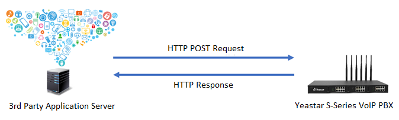
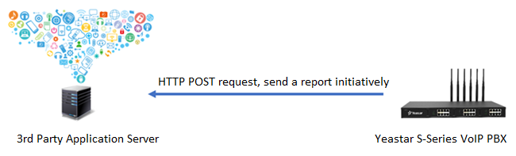

## Interaction Method（新增交互方式1的说明） {#interaction-method}

S-Series VoIP PBX interacts with the application server through HTTPS protocol: sends HTTPS request, and receives the application server's HTTPS response. S-Series VoIP PBX and the application server both act as a server and a client for each other.

**Interaction Protocol**

The default interaction protocol is HTTPS. It will use the same protocol of the S-Series VoIP PBX webpage. It is recommended that the user replace it with a certificate issued by a professional provider.

**Contents**

Contents are defined by .json.

**Interaction Method**

There are two interaction methods between S-Series VoIP PBX and the application server.

  **1. The application server sends request to S-Series VoIP PBX.**

In this case, the application server is the client, and S-Series PBX will function as the server. The picture below shows this scenario: the application server initiates the call and the query.

**Note:** all API requests require the token returned when S-Series API login authentication is passed, namely, the token for interface invocation, which is valid only for 30 minutes. Within the validity time of the token, if there is no event interaction between the API and the application server \( for example, the application server sends API request to the PBX, or S-Series API sends event report to the application server\), the token will be erased by the PBX. The application server can prolong the validity time of the token by sending a Heartbeat packet to the PBX via the Heartbeat packet interface. Every time a packet is sent, the token validity time will be prolonged for 30 minutes.

  **2. S-Series VoIP PBX pushes notifications to the application server.**

In this case, the application server is the server, and S-Series VoIP PBX will function as the client.

**Condition:** the application server needs to pass the S-Series API authentication and establish connection with S-Series API.

The picture below shows this scenario: S-Series VoIP PBX notifies the application server with the change of extension's call status.

